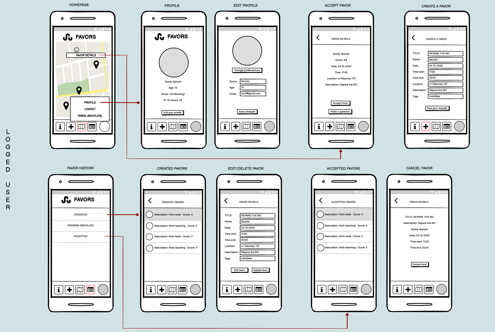
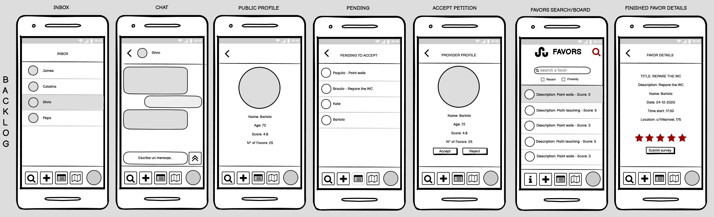

# Favor Forward

## Description

Favor forward is a page meant for charitable harts that want to contribute to their local community. Basically, it offers a platform to ad or request "favors"  for others to offer help based on their current location.


## User Stories


- **404** - As users, we want to be politely warned that this page does not exist and it was our fault to search for it.
- **500** - As users, we want to be politely warned that the amazing team behind the project screwd it up and it's not our fault.​ :broken_heart
​
**PUBLIC USER**:
​
- **Homepage** - As a public user, we can see that the homepage has a map with locations pined in it and a navigation bar at the bottom. In the navigation bar we have a map, an info and a user icon that we can click. Clicking on the user we have a menu displayed with the sign up and the login. If we click on the info icon we will go to the info page.
- **Info** - As a public user, we can see the info of the page and a link to the login.
- **Login** - On this page we can login with our email and password or if we don't have an account yet, we have a link to the sign up. By clicking on the Login button we will be redirected to the main page as a logged user.
- **Sign Up** - On this page we can create an account by introducing a non used email and a password. If we click on the Sign Up button we will create the account and we will be logged in automatically and redirected to the Homepage as a logged user.
- **Accept Favor** - On this page we will see the details of the favor but as we are not logged in we won't be able to accept to do it, instead we will be redirected to the Login page.
​
**LOGGED USER**:
​
- **Homepage** -  As a logged user, we will have a new navigation bar with 2 new icons, add and history and (this bar will be always present so we will be able to navigate from the different pages). The user icon will be changed by your own image or a default image that you can change later in your profile. Now, by clicking on that image, the menu displayed will have different routes: Profile and Logout. By clicking on the logout you will be logged out and redirected to the public Homepage.
- **Info** - The info page will stay the same less for the link to the login page that will no longer be there.
- **Profile** - On the profile page we will be able to see our information and we will have an edit button that will open a new page to change the info.
- **Accept Favor** - Now that we are logged in, we will be able to accept the favor, and  it will appear a new button to make a  question to the person who is requesting.
- **Create Favor** - By clicking on the add button we will go to add favor page. As a logged user we will want to post what we need as a favor. So, in here, we will have a template with all the details of the favor that we will be able to fill in. Then, there is a button to post the favor and make it "public".
- **Favors History** - On this page we find buttons, one for the created favors, and another for the accepted. if we click on them we will go to the respective pages.
- **Created Favors** - Here we will have a list of the favors that we posted. If we click on them we will open a new page where we can see the info of the favor and where we can Edit or Delete it.
- **Accepted Favors** - We will have another list of favors, but this one is of the favors that we have done, or going to do to other people. if we click con them we will open a new page with all the info of the favor.
​


## Wireframes






## Server Routes (back-end)

| L    | **Method** | **Route**               | **Render View/ from-to**               | **Request - Body**                                           |
| ---- | ---------- | ----------------------- | -------------------------------------- | ------------------------------------------------------------ |
|      |            | **P  U  B  L  I  C**    |                                        |                                                              |
| 1    | `GET`      | `/`                     | Home                                   | `[{favor.location}]`                                         |
| 2    | `GET`      | `/:id/favordetail`      | Dashboard>**FavorDetail                |                                                              |
| 3    | `GET`      | `/info`                 | *>**Info**                             |                                                              |
|      |            | **P  R  I  V  A  T  E** |                                        |                                                              |
| 1    | `GET`      | `/auth/signup`          | *>**Signup**                           |                                                              |
| 2    | `POST`     | `/auth/signup`          | Signup>**Home**(prev page)             | `{email, password}`                                          |
| 3    | `GET`      | `/auth/login`           | *>**Login**                            |                                                              |
| 4    | `POST`     | `/auth/login`           | Login>**Home**(prev page)              | `{email, password}`                                          |
| 5    | `GET`      | `/auth/logout`          | *>**Home**                             |                                                              |
| 6    | `GET`      | `/user/dashboar/`       | *>**Dashboard**   (using current user) | `{age, name, email, password, profilepic, favorsAsked, favorsProvided, fRecived, fRecivedScore, fGived, fGivedScore}` |
| 7    | `GET`      | `/user/edit`            | Dashboard>**UserEdit**                 | `{age, name, email, password, profilepic}`                   |
| 8    | `POST`     | `/user/edit`            | UserEdit>**Dashboard**                 | `{age, name, email, password, profilepic}`                   |
| 9    | `GET`      | `/favor/create`         | Dasboard>**FavorCreate**               | `{askerUserId, title, date, timeStart, timeEnd, description, tags, location}` |
| 10   | `POST`     | `/favor/create`         | FavorCreate>**FavorDetail**            | `{askerUserId, title, date, timeStart, timeEnd, description, tags, location}` |
| 11   | `GET`      | `/favor/:id/edit`       | FavorDetail>**FavorEdit**              | `{askerUserId, title, date, timeStart, timeEnd, description, tags, location}` |
| 12   | `POST`     | `/favor/:id/edit`       | FavorEdit>**FavorDetail**              | `{askerUserId, title, date, timeStart, timeEnd, description, tags, location}` |
| 13   | `POST`     | `/favor/:id/delete`     | FavorDetail>**Dashboard**              |                                                              |
| 14   |            |                         |                                        |                                                              |


## Models

User model

```javascript
{
    age: { type: Number, min: 16 }, 
    name: { type: String },
    email: { type: String, match: /^([\w-\.]+@([\w-]+\.)+[\w-]{2,4})?$/, required: true, unique: true },
    password: { type: String, minlength: 2, required: true }, 
    profilepic: { type: String, default: '/images/icon-userdefault.png' }, 
   
    favorsCreated: [{ type: Schema.Types.ObjectId, ref: 'Favor' }],
    favorsProvided: [{ type: Schema.Types.ObjectId, ref: 'Favor' }],

    fRecived: Number, 
    fRecivedScore: Number,
    fGived: Number,
    fGivedScore: Number
}
```

Favor model

```javascript
{
    createrUserId: { type: Schema.Types.ObjectId, ref: 'User' }, //person who creates it
    providerUserId: [{ type: Schema.Types.ObjectId, ref: 'User' , default: null}],
    title: { type: String, maxlength: 50},
    date: { type:Date, required: true},
    timeStart:  { type:Date, required: true },
    timeEnd:  { type:Date, required: true },
    description: { type:Date, required: false },
    tags: [String],
    comments: [{user: { type: Schema.Types.ObjectId, ref: 'User' }, comment: String}], 
    status: { type: String, enum: [ "Favor Created", "Favor Accepted", "Favor Finished"], default: "Favor Asked"},
    satisScore: {
        createrToProviderScore: { type: Number, enum: [1, 2, 3, 4, 5], required: true},
        createrToProviderComment: { type: String, required: true},
        ProviderToCreaterScore: { type: Number, enum: [1, 2, 3, 4, 5], required: true},
        ProviderToCreaterComment: { type: String, required: true}
    },
    location: { type: { type: String }, coordinates: [Number] }
},
{ 
    timestamps: {createdAt: 'create_at', updatedAt: 'updated_at' }
}
```


## Backlog
​
- **Satisfaction Score** - when the favor is finished, both users (the creator of the favor and the provider), can go to the history, click on the favor and rate the quality of the experience. Then, as a user, we will have a score in our profile with all the ratings that we got.
- **Search/Board** - As a public user, we will want to see all the favors in a list and we want to be able to search for any favor in a search bar. If we click on a favor we will open the Accept Favor page to see the details and accept it.
- **Pending** - when we create a favor, maybe, we will have different proposals to help to do the favor. So we don't want to accept the first one, we want to chose and accept the best candidate. In the favors history we have another page with the list of the users that are offering to help you. If we click on one of them we will be able to see their profile and then Accept or Reject them.
- **Chat** - as users, we will want to communicate with other users to be clearer on how to do the favors, the time, the exact location or some other details.
- **Inbox** - as users we will want to have an Inbox where we store all the chats, to talk to other users whenever we want.
- **Public profile** - we want to see the others users profiles to see their score and the information they have.
​
 


## Links

#### Git

[Repository Link](https://github.com/clayrisse/favorforward)

[Deploy Link](https://favorforward.herokuapp.com/)

#### Trello

[Our Trello board](https://trello.com/b/twrgxecA/favor-trello)

#### Slides

[Our amazing presentation!](https://docs.google.com/presentation/)

#### API

[MapBox API!](https://www.mapbox.com/)
